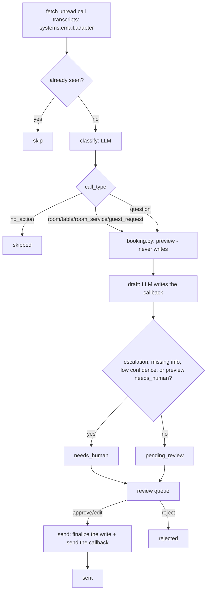

# Voice / Phone AI — "The Switchboard"

Answers the phone 24/7 in the guest's own language — eight languages and a choice of voices on the demo line. It checks live availability and quotes real rates, books rooms straight into the PMS, reserves restaurant tables, takes room-service orders, and logs guest requests onto the concierge desk — every action landing in the same systems your dashboards read, while the call is still going. Answers questions from the hotel knowledge base, captures messages, and routes urgent calls to a human.

**Read `docs/how-it-works.md` before anything else.** This repo has no live
telephony. It processes finished call transcripts — a voicemail-to-text
message, a call-recording transcript, or a note a staff member types up
after taking a call — not a live conversation. That one fact shapes
everything below it; the rest of this README explains what that means in
practice and what it takes to add real-time answering later.

## What it does

Answers the phone 24/7 in the guest's own language — eight languages and a choice of voices on the demo line. It checks live availability and quotes real rates, books rooms straight into the PMS, reserves restaurant tables, takes room-service orders, and logs guest requests onto the concierge desk — every action landing in the same systems your dashboards read, while the call is still going. Answers questions from the hotel knowledge base, captures messages, and routes urgent calls to a human.

In this template specifically: it reads a finished call transcript, works
out what the caller needed, runs a genuine availability/pricing/menu check
against your own data, drafts a callback, and queues it for a person to
approve before anything leaves the building or gets written anywhere. See
"Who it's for" below for exactly what that buys you today.

## What it won't do

Hands complex or emotional calls to a human, confirms details back to the guest before committing a booking, and never quotes a rate it can't see in the system.

All three of those are true here, and the third is enforced the same way
the roster describes: every price comes from a real availability check
(`docs/how-it-works.md` design decision 6), never a guess. The first two are
true by construction rather than by a prompt instruction: there is no
transfer tool (there is no telephony at all — see above), so "hands complex
calls to a human" becomes an `escalation` block that always forces a person
to look; and "confirms details back before committing" is structurally
guaranteed because nobody is on the line by the time this agent sees a
call — every booking, order and request waits for a human to approve it
before it is ever written or sent (design decision 4).

## Why it matters

Most small hotels miss a large share of calls after hours = lost bookings.

## What to expect

Captures the 20–40% of calls that currently go unanswered — with the bookings, table reservations and orders they contain written into your systems live.

The roster text above is quoted exactly as it appears on the demo platform's
agent menu — this repo does not promise more than that, and does not
promise less. The "while the call is still going" and "captures 20-40% of
calls" parts of that promise describe a fully live phone line; this
template gets you the classification, the genuine availability check, the
drafting and the review-queue safety net, all working today on `mock`
fixtures, and the honest list of what a telephony provider still needs to
add on top — see `docs/integrations.md`.

## Who it's for

Independent hotels, guesthouses and small restaurants where a real share of
calls happen after hours or during a busy service, and where a voicemail or
a missed-call note currently sits until someone has time to listen to it
and follow up by hand. It replaces the "listen to the voicemail, work out
what they wanted, call them back, remember to write it down somewhere" part
of that job, not a live receptionist picking up the phone.

You will get the most from this repo if:

- Your phone system, voicemail service, or a call-recording add-on can
  already deliver a transcript by email, or you are willing to have a staff
  member type up a quick note after a call — see `docs/integrations.md`.
- You have a PMS or at least a CSV export of your reservations, so
  availability checks are real rather than a guess.
- You run a restaurant and/or room service alongside the rooms.
- Callers speak more than one language.
- You are comfortable reviewing AI-drafted callbacks before they go out, at
  least at first — this ships in shadow mode and stays there until you say
  otherwise.

It is less of a fit if you need a live phone line answered the instant it
rings — that is a genuinely different project needing a telephony provider
on top of this repo, not a config change (`docs/how-it-works.md`,
`docs/integrations.md`). `venues: hotel, restaurant` on the roster card
applies here too: a restaurant-only property can use this repo by leaving
`rooms.room_types` empty in `config/agent.yaml` and relying on
`table_booking`, `room_service` (as collection/takeaway orders — set
`room_number` to a pickup time or a phone number instead) and
`guest_request`.

## How it works

One loop, no sub-agents and no coach layer folded into this repo.



**One model call** reads the transcript and decides what the caller needed
(`prompts/classify.md`): a `call_type`, the caller's language and contact
details, the structured booking fields, and an `escalation` block if the
call trips a guardrail. **The booking itself is always computed by code**,
never guessed by the model (`tools/pricing.py`, `tools/booking.py`) —
availability, restaurant hours and room-service prices come from your own
configuration and your own data, the same way for every LLM provider. **A
second model call** writes the callback (`prompts/draft.md`). Full detail,
the exact design decisions this repo makes and why, and the idempotency
guarantees: `docs/how-it-works.md`.

### The two modes

| Mode | What happens |
|---|---|
| `shadow` (default) | Reads, classifies, previews every booking, and queues. Never sends, never writes anywhere. |
| `live` | Items you approved are really sent, and the booking/order/request behind them is really written. Everything else still waits. |

### The review loop

Nothing reaches a caller, and nothing is written, without a person
approving it first (unless you narrow `review.require_approval_for` once
you trust the drafts). `workflows/80-review.md` covers the full loop: list,
show, approve, edit, reject, send.

### What runs when

| Workflow | Cadence | Provider used |
|---|---|---|
| `workflows/10-calls.md` (`tools/run.py`) | every 10 minutes, or `make watch` | whatever `llm.provider` is set to |
| `workflows/80-review.md` (`tools/review.py`) | whenever a human is available | none — queue operations only |

See `docs/how-it-works.md` for the full flowchart, the design decisions
taken where the source spec was open, and the idempotency guarantees.

## What you need

| Item | Required? | Notes |
|---|---|---|
| A computer or small server that can run Python 3.11+ | Yes | Your laptop is fine to start; `workflows/90-go-live.md` covers scheduling it properly. |
| A Claude Code subscription, or your own Anthropic API key | Yes | The `interactive` provider uses the Claude Code session you already have open — zero extra cost. See "Run it" below. |
| A way to get a call transcript into a mailbox (IMAP or Gmail) | Recommended | Starts on `mock` fixtures; connect a real one when ready. A voicemail-to-text service, a call-recording/transcription add-on, or a staff member typing up a summary all work. |
| A PMS, or at least a CSV export of your reservations | Recommended | Starts on `mock` fixtures; the `csv` adapter works with any PMS. Reads only — see `docs/how-it-works.md` design decision 2. |
| A WhatsApp Business number (via your own UniPile account) or a webhook target | Optional | Only needed to call back a caller who left a phone number but no email. |
| A telephony provider (Retell, Twilio, Telnyx, ElevenLabs realtime, Vonage) | Not included | Only if you want a live phone line answered in real time — see `docs/integrations.md`. |

Time estimate: 15 minutes to see the demo, half a day to connect a real
mailbox and fill in your property's `knowledge/` files, a few days of
watching the review queue before you would reasonably consider going live.

## Quick start (5 minutes, no credentials)

```bash
git clone https://github.com/th1-ai/voice-phone-ai.git voice-phone-ai
cd voice-phone-ai
make setup
make demo
```

You should see something like this (shortened):

```
Voice / Phone AI demo - 12 sample call transcript(s) from fixtures/inbound/

  call-01: "Voicemail transcript - 0:42 - caller +1 555 0101" -> call_type=room_booking confidence=0.95 status=pending_review
  call-02: "Voicemail transcript - 0:35 - caller +1 555 0112" -> call_type=room_booking confidence=0.94 status=pending_review
  call-03: "Voicemail transcript - 0:51 - caller +1 555 0123" -> call_type=room_booking confidence=0.90 status=needs_human
  ...
  call-12: "Voicemail transcript - 0:04 - caller withheld" -> call_type=no_action status=skipped (no action needed)

4 of 11 drafted callback(s) need a person to look first - see docs/safety.md for what always does.
Nothing was sent: mode is shadow, and demo never calls send() at all.
Next: `make review` to see the drafts, or read workflows/10-calls.md.

DEMO OK - 12 items processed, 11 drafted, 0 sent (shadow)
```

Every one of those calls is an invented sample — a fictional "Hotel
Aurora" — so you can see exactly how Voice / Phone AI thinks before it ever
touches a real mailbox. Notice `call-02`: the Hotel Aurora Suite is sold out
for those dates in `fixtures/hotel/reservations.json`, and the agent offers
an alternative instead of guessing — that is the genuine availability check
in action. Next: open `claude` in this folder and follow "Set up with
Claude Code" below.

## Set up with Claude Code

Open `claude` in this folder. Paste each prompt below in order — Claude will
follow the named workflow file, which tells it exactly which tools to run
and what to check.

**Phase 1 — first run.**

> Read `workflows/00-setup.md` and walk me through it. I have not run this
> agent before.

**Phase 2 — the calls loop.**

> Read `workflows/10-calls.md`. Run one pass and show me what Voice / Phone
> AI did with each call transcript in plain language.

**Phase 3 — the review queue.**

> Read `workflows/80-review.md`. Show me what is waiting for me, one at a
> time, and act on my decisions.

**Phase 4 — going live.**

> Read `workflows/90-go-live.md`. Go through the checklist with me honestly
> — do not recommend going live until it is genuinely true.

You can also just run the agent directly — `/voice-phone-ai` in this folder
runs the main loop and works the queue in one command; see
`.claude/skills/voice-phone-ai/SKILL.md`.

## Connect your systems

Full detail, including the "implement your own" recipe and the honest
telephony gap, is in `docs/integrations.md`. This section covers only what
Voice / Phone AI itself uses.

### Call transcript source — `systems.email.adapter` in `config/hotel.yaml`

| Adapter | Status | Needs |
|---|---|---|
| `mock` | universal | nothing — reads `fixtures/inbound/*.json` |
| `imap` | universal | mailbox + app password |
| `gmail` | built | Google OAuth desktop client |

This is the channel this agent ingests calls through — see
`docs/how-it-works.md` for why email is the right channel even though
nothing here is a live phone call. It also sends the callback when a caller
left an email address.

**Testing against your own sample calls first.** Set
`systems.email.fixtures_dir` in `config/hotel.yaml` to a folder of your own
sample call transcripts (same JSON/eml shape as `fixtures/inbound/`), and
the `mock` adapter reads those instead — a way to rehearse on real-shaped
calls before you connect a mailbox, without changing `make demo`'s
documented output. See `docs/integrations.md`.

### PMS — `systems.pms.adapter` (reads only)

| Adapter | Status | Needs |
|---|---|---|
| `mock` | universal | nothing — reads `fixtures/hotel/reservations.json` |
| `csv` | universal | a CSV export in `data/imports/` |
| `cloudbeds` | built | `CLOUDBEDS_CLIENT_ID`, `CLOUDBEDS_CLIENT_SECRET`, `CLOUDBEDS_REFRESH_TOKEN` |
| `cli` | universal | `PMS_CLI_COMMAND`, `PMS_CLI_PROFILE` — a JSON-speaking vendor CLI |

Voice / Phone AI never writes to your PMS directly — it reads
`list_reservations()` for a genuine availability check and, when a caller
names an existing reservation, appends a note with `add_note()`. See
`docs/how-it-works.md` design decision 2 for why there is no PMS write for
a brand-new booking anywhere in this family's shared `core/`.

### Messaging — `systems.messaging.adapter` (callback delivery + urgent alerts)

| Adapter | Status | Needs |
|---|---|---|
| `mock` | universal | nothing — logs to `data/exports/sent_messages.jsonl` |
| `unipile` | built | `UNIPILE_DSN`, `UNIPILE_API_KEY`, `UNIPILE_ACCOUNT_ID` — your own account, your own WhatsApp number |
| `webhook` | universal | `MESSAGING_WEBHOOK_URL` — POST to Zapier, Make, n8n, or your own endpoint (including a real SMS provider) |

Used to call back a caller who left a phone number but no email, and to
alert staff immediately when an urgent guest request
(`config/agent.yaml: guest_requests.urgent_categories`) is approved and
sent.

### Sheets — `systems.sheets.adapter`

Not used by this agent's own code; available for `make report --json`.

| Adapter | Status | Needs |
|---|---|---|
| `csv` | universal | nothing — writes `data/exports/*.csv` |
| `google` | built | `GOOGLE_SHEET_ID`, `GOOGLE_SERVICE_ACCOUNT_FILE` |

### Everything else

`pos`, `accounting`, `reviews`, `calendar`, `payments`, `procurement` and
`locks` are **stubs** in `core/adapters/` — Voice / Phone AI does not use
any of them itself. **Telephony is not even a stub** — there is no
interface for it anywhere in this family's shared `core/`; see
`docs/integrations.md` for what a real phone line still needs.

Check what is actually working on your machine at any time:

```bash
make doctor
```

## Run it

```bash
make run                          # one real pass over new call transcripts
make run ARGS="--limit 5"         # just the first five
make run ARGS="--dry-run"         # compute everything, write nothing
make watch                        # keep running on the configured interval
```

**Scheduling.** `config/agent.yaml`'s `schedule:` block names the job this
agent needs — `calls`, every 10 minutes — with the real command. Print it,
already filled in with the right absolute paths for this machine, with:

```bash
make schedule ARGS="--all"
```

Paste that straight into `crontab -e`. `scheduler/crontab.example`,
`scheduler/launchd.example.plist` and `scheduler/systemd.example.service`
plus `scheduler/systemd.example.timer` have one hand-editable example each,
for a Mac, a Linux box, or a VPS, if you would rather not use `--all`.
`make schedule` on its own (see `core/schedule.py`) generates a snippet for
any single command and cadence you name.

**Subscription or API.** `llm.provider: interactive` or `claude-code` runs
on the Claude Code subscription you already pay for — genuinely the
cheapest way to run a small property's agent, with the caveat that
Anthropic's usage policy governs automated use of a personal subscription (a
handful of scheduled runs a day is normal; hammering it around the clock is
not). `llm.provider: anthropic` uses your own API key, bills per token, and
is the right choice for production volume. `make report` shows what you are
actually spending either way — see `docs/safety.md` for the full honest
note.

## Go live

Shadow mode is the default and stays the default until you change it. The
full checklist — real config filled in, a few days of real review behind
you, the AI-disclosure and call-recording-consent lines added, a real
mailbox connected — is in `workflows/90-go-live.md`. In short:

```yaml
# config/hotel.yaml
mode: live
```

Going live means an **approved** item now actually sends, and the
booking/order/request behind it is actually written — it does not change
what needs approval. `review.require_approval_for` still lists
`send_email`, `send_message` and `pms_write` by default. Going back to
shadow (`mode: shadow`, or `AGENT_MODE=shadow` in `.env` for one run) stops
every outbound action immediately, mid-schedule.

## Guardrails & safety

Full detail in `docs/safety.md`. The short version:

**What it will not do.**

- Send anything while `mode: shadow`, or send an item nobody approved.
- Write a room, table, room-service or guest-request row, or forward a
  guest fact, without a human having approved the callback first.
- Answer a live phone call, transfer a call, or record one — there is no
  telephony in this repo at all.
- Take a payment, issue a refund, or move money — payment adapters are
  read-only by design.
- Quote a rate, an availability count, or a menu total that is not computed
  by `tools/pricing.py`/`tools/booking.py` from your own configuration and
  data. When it is not sure, it asks — it never guesses.

**What always escalates**, whatever the model itself decides
(`knowledge/policies.md`, enforced in code by `tools/engine.py`):

- Any complaint, or a caller who sounds upset, frustrated or distressed.
- Anything safety- or security-shaped, or a payment dispute.
- A medical need, a mobility need, or a pregnancy.
- Large groups: 6+ guests in a single room request, or a party of 7+ at the
  restaurant.
- A caller who spoke a language not in `hotel.languages`.
- Anything the model itself is under `confidence_threshold` confident about.

**Data handling.** Everything lives in `data/agent.db` on your own machine —
there is no cloud service behind this repo. Card numbers are redacted on
ingestion (`core/redact.py`) before they are stored, logged, or put in a
prompt, regardless of any config setting. `privacy.retention_days` controls
how long processed items stay in the database.

**AI disclosure (EU AI Act Article 50).** Every callback this repo drafts
carries a line saying it was prepared with AI assistance and reviewed by a
person — see `knowledge/signature.example.md` for the wording and
`docs/safety.md` for the full context, including call-recording consent.
Keep the escape hatch: a caller who wants a human should never have to work
out how to get one.

## Customising

**`knowledge/`.** The agent's memory of your property —
`knowledge/property.md`, `knowledge/faq.md`, `knowledge/policies.md`,
`knowledge/signature.md`. See `knowledge/README.md` for how to write each
one well. `knowledge/policies.md` is loaded into every single prompt, so it
is the highest-leverage file in the repo — get the escalation list right
before anything else.

**`prompts/`.** `prompts/classify.md` and `prompts/draft.md` are plain
markdown with `{{var}}` placeholders — edit them directly to change how
Voice / Phone AI reasons or what tone it writes in. The JSON schema each one
must answer to lives next to it in `prompts/schemas/`.

**`config/agent.yaml`.** Your real room types, restaurant hours and closed
days, room-service menu, `confidence_threshold`, and
`guest_requests.urgent_categories`.

**Adding a language.** One place: `hotel.languages` in `config/hotel.yaml`
— the classify step already handles any language the model can read and
write. A caller who spoke a language not on that list always gets a
callback in the hotel's own default language instead, and the item is
queued for a human — see `docs/how-it-works.md` design decision 11.

**Room types and the room-service menu.** Both are plain config, not code —
`rooms.room_types` and `room_service.menu` in `config/agent.yaml`. Room
type ids must match whatever your PMS adapter reports for
`room_type_id` (`fixtures/hotel/reservations.json` for the `mock` adapter).

## Troubleshooting & FAQ

Full list in `workflows/99-troubleshooting.md`. The most common ones:

**`make doctor` shows a FAIL.** Every line has a fix hint right under it —
read it before doing anything else.

**`make run` exits with code 3.** Not an error — `llm.provider: interactive`
is waiting for you to answer a parked prompt in `data/pending/`.

**A room, table, room-service or guest-request callback gets approved but
nothing gets written.** `python3 tools/review.py show <id>` shows exactly
why `finalize_action` failed, rather than silently dropping it.

**"no callback channel captured on this call".** The caller left no email
and no phone number. Call them back yourself, then
`python3 tools/review.py reject <id> --reason "called back manually"` — see
`workflows/80-review.md` step 5.

**Can I run this without a PMS at all?** Yes — leave `systems.pms.adapter`
on `mock` or `csv`. Room pricing comes from `config/agent.yaml` either way;
only the genuine availability count and the optional PMS note need a real
connection.

**I don't have a telephony provider — is this still useful?** Yes. Read
`docs/how-it-works.md` and `docs/integrations.md` — this repo is useful the
moment you have any way to get a call transcript into a mailbox. Real-time
answering is a separate, later project.

**Can I try it on my own sample calls before connecting a real mailbox?**
Yes, without touching `fixtures/inbound/` — set `systems.email.fixtures_dir`
in `config/hotel.yaml` to your own folder. See "Call transcript source"
above.

## Measuring the benefit

`make report` shows call volumes, what has actually been written to the
ledger, the edit rate, time to first draft, and spend — all computed from
`data/agent.db`, nothing phoned home. See `docs/benefits.md` for what each
number means and the caveats worth keeping in mind before you quote any of
this to someone else.

```bash
make report
python3 tools/report.py --json
```

## About

Built by [TH1](https://th1.ai) — we build and run AI agents for
independent hotels. This repo is free to use, modify and self-host under
the MIT licence (see `LICENSE`).

Want it run for you, tuned to your property, with someone accountable for
the result — including the telephony side this template does not build?
[Talk to TH1](https://th1.ai).

**Changelog**

- v1.0 — initial release: call-transcript classification, genuine
  availability-checked room/table/room-service/guest-request previews, the
  review-queue safety net, and the honest telephony gap documented in
  `docs/integrations.md`.
