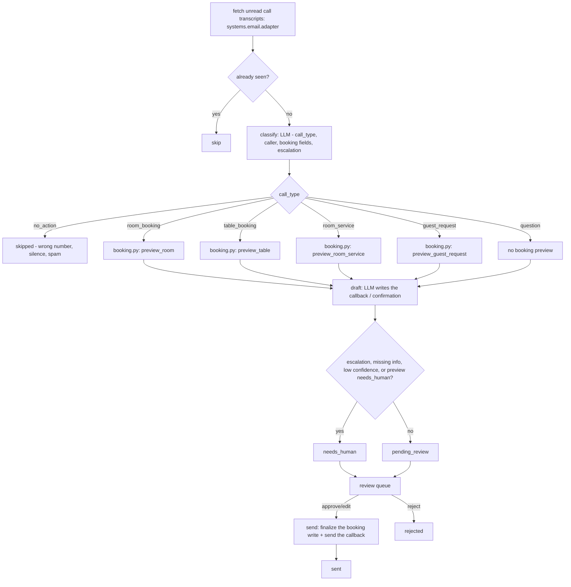

# How Voice / Phone AI works

**Read this first if you are building or reviewing this repo.** It has no live
telephony (see "What this repo actually is" below) - everything else follows
from that one honest fact.

## What this repo actually is

The source this template was built from is a hosted, real-time voice agent
(ElevenLabs realtime, bound to seven client-side tools) answering an actual
phone call while it is still ringing. **That stack is not in this repo, and
this repo does not pretend it is.** No phone number, no SIP trunk, no ring
routing, no live speech.

What this repo does instead: it processes **finished call transcripts** -
a voicemail-to-text message, a transcript your call-recording or answering
system emails you after the fact, or a note a staff member types up after
taking a call. Many small-hotel phone systems and voicemail services already
deliver exactly that, by email, today. So this agent reuses
`systems.email.adapter` - the same mailbox connector every other repo in this
family uses - as its ingestion channel: point it at a mailbox that receives
call-transcript emails (or, for the demo, at the sample transcripts in
`fixtures/inbound/`), and every unread message in it is treated as one
finished call.

Going from this to answering a live call for real needs a telephony provider
(Retell, Twilio, Telnyx, ElevenLabs realtime, Vonage...) wired into a webhook
that posts the transcript here the moment a call ends, or that calls the
tools in this repo directly while the call is live. `docs/integrations.md`
says exactly what is built, what is universal, and what a hotel still has to
add - never the reverse.

## The loop (`tools/run.py`, `tools/engine.py`)

One model call reads the transcript and decides what the caller needed
(`prompts/classify.md`, schema `prompts/schemas/classify.json`): a
`call_type`, the caller's language and contact details, the structured
booking fields if any, and an `escalation` block if the call trips a
guardrail. The booking itself is always computed by code, never guessed by
the model (`tools/pricing.py`, `tools/booking.py`) - availability, restaurant
hours, the room-service menu and prices all come from your own configuration
and your own data, the same way for every LLM provider (`mock`,
`interactive`, `claude-code`, `anthropic`). A second model call writes the
callback (`prompts/draft.md`). Both calls go through `core.llm.complete()`
with a JSON schema - nothing else in this repo calls a model.

**Six call types**, one per T1-T6 in the source spec (T7, `send_sms`, has no
tool of its own here - see design decision 8):

| `call_type` | What it captures | Preview function |
|---|---|---|
| `room_booking` | a stay enquiry or a request to book a room | `preview_room` |
| `table_booking` | a restaurant reservation | `preview_table` |
| `room_service` | an in-room dining order | `preview_room_service` |
| `guest_request` | anything for the concierge desk - transport, housekeeping, maintenance, a general request | `preview_guest_request` |
| `question` | answerable from `knowledge/` - no booking preview | - |
| `no_action` | a wrong number, dead air, spam, an unintelligible message | - (skipped, no draft, no callback) |

## Deterministic execution, always

The classify step never invents a rate, a table slot, a menu price or a
callback channel - `tools/pricing.py` and `tools/booking.py` compute those
from `config/agent.yaml` and your own reservations, the same way every time.
If a caller asks for a Tuesday table and the restaurant is closed Mondays but
open Tuesdays, the code - not the model - knows that.

## What runs when

| Workflow | Cadence | Provider used |
|---|---|---|
| `workflows/10-calls.md` (`tools/run.py`) | every 10 minutes (`config/agent.yaml: schedule.calls`), or `make watch` | whatever `llm.provider` is set to |
| `workflows/80-review.md` (`tools/review.py`) | whenever a human is available | none - queue operations only |

There is no second loop and no coach layer in this repo (the brief for this
agent folds in no sub-agents and the coach does not apply to it - see
`docs/integrations.md` and the roster).

## Design decisions taken where the spec was open

The behavioural spec this repo was built from (`specs/voice-phone-ai.md` in
the factory that built this template, if you have it) documents a real
production system with several open questions - its own section 11 names
most of them directly. Every one of the following is a deliberate decision,
made in the direction of this whole family's architecture (shadow by
default, deterministic decisioning, honest about what is and is not built),
not an oversight.

1. **No live telephony (spec section 11, point 1).** Covered above under
   "What this repo actually is." This is the largest, and the only
   unavoidable, gap between this template and a fully live phone line.

2. **No PMS write exists for creating a brand-new reservation, anywhere in
   this family's shared `core/`.** `core/adapters/base.py:PMS` has
   `add_note`, `update_reservation`, `set_rate` and `set_room_status` -
   every one of them assumes the reservation, table or order already exists.
   That is deliberate on the factory's side: every PMS's own
   create-a-reservation API differs too much (rate plans, guarantee
   policies, deposit rules) for one generic call to be honest about. So a
   room booking, a table booking, a room-service order and a guest request
   captured here are written to **this agent's own ledger** -
   `room_bookings`, `table_bookings`, `room_service_orders` and
   `guest_requests` in `tools/store_ext.py` - guarded by
   `core.review.assert_write_allowed` exactly like a real PMS write, and
   additionally: `pms.add_note()` fires when the caller named an existing
   reservation reference, and `messaging.notify_staff()` fires for anything
   in `guest_requests.urgent_categories`. Flagged as a core request in the
   factory build report - see the report for this repo.

3. **Two-phase preview / finalize, borrowed from this family's own
   precedent.** `tools/booking.py`'s `preview_*` functions run at classify
   time, for every call, and never write anything - they compute what
   *would* happen (availability, price, cover count, a menu total) so the
   draft callback can describe it honestly. `finalize_action` runs once, at
   send time, only for an item a human approved or edited, and only when the
   original preview actually succeeded - a request the preview already
   rejected (closed day, sold out, an unknown room type) can never become a
   confirmed row, approved or not.

4. **"Confirms details back to the guest before committing a booking" (the
   roster's `cant`) is structurally true here, not a prompt instruction
   nobody enforces.** The source system relies on the hosted agent's own
   prompt to read details back mid-call; nothing in its seven tools actually
   checks. Here nobody is on the line by the time this agent sees the
   message at all - so **every** room, table, room-service or concierge
   action waits in the review queue, and the only way anything leaves is a
   person approving or editing it first. The review step itself is the
   "confirm before committing" behaviour the roster promises.

5. **"Hands complex or emotional calls to a human" / "routes urgent calls to
   a human" (spec section 11, point 2: there is no transfer tool, live or
   here).** A real-time transfer is out of scope without a telephony
   provider. What this repo does instead: `escalation` on the classify
   result (with `urgent_transfer` as one of its categories, alongside
   `complaint`, `safety`, `payment`, `policy_exception`, `missing_info` and
   `vip`) always forces `needs_human`; and for a `guest_request` in
   `config/agent.yaml: guest_requests.urgent_categories`,
   `tools/booking.py:finalize_action` also calls
   `core.adapters.get_messaging(settings).notify_staff()` the moment it is
   approved and sent, so a person is nudged immediately rather than only
   finding it on the next queue check.

6. **Genuine availability, not a guess.** `tools/booking.py:preview_room`
   counts real overlapping *confirmed* reservations from
   `pms.list_reservations()`, **plus** anything this agent has already
   *finalized* (written, after a human approved and sent it - see design
   decision 3) in its own `room_bookings` ledger, against the inventory cap
   in `config/agent.yaml: rooms.room_types.<slug>.count`. That is the same
   `INVENTORY[type] - booked[type]` shape the spec documents for its own T1
   tool, sourced from your real PMS reads (`mock`, `csv` or `cloudbeds`)
   instead of the demo's own hard-coded numbers. A preview never writes, so
   two calls previewed in the same pass, before either is approved, still
   see the same starting availability - a person working the review queue,
   not this check, is what catches two calls chasing the last room before
   both are sent (`workflows/80-review.md`).

7. **Room-service totals support quantities (spec section 11, point 7: "two
   club sandwiches price as one" is a named gap in the source).** The
   classify step extracts `{name, qty}` pairs rather than one regex match
   per message; `tools/pricing.py:match_menu_item` multiplies price by `qty`
   before the flat tray charge is added. An item that does not match the
   configured menu is reported by name rather than silently dropped or
   priced at zero.

8. **`send_sms` (T7) is not its own tool.** The source simulates an SMS and
   logs a line saying so. Here, the guest-facing callback drafted for every
   call type **is** the outbound message, and it sends for real (subject to
   `mode: shadow`, like every other write in this family) through whichever
   channel the call actually gives you: email, when the caller left an
   address; WhatsApp/chat (`systems.messaging.adapter`), when they left a
   phone number and messaging is configured; otherwise the item stays
   `needs_human` with a plain "call this number back yourself" note, and the
   draft is still written as a script a person can read straight off the
   screen. There is no dedicated SMS adapter in this family's shared `core/`
   - see `docs/integrations.md` for the honest gap and the recipe to add
   one via the `webhook` channel and a provider like Twilio or Telnyx.

9. **Room-service orders start at `placed`, not `preparing` (spec section
   11, point 6).** The source inserts a Voice AI order directly into
   `preparing`, skipping a kitchen's own first queue state. Here every order
   starts at `status: placed`, so it enters a kitchen's normal workflow at
   the beginning like any other order, not one step in.

10. **Table availability is one venue-wide cover cap with a rolling seating
    window (spec section 11, point 8: no table-level check exists in the
    source either).** `tools/store_ext.py:count_table_covers_in_window` sums
    party sizes of this agent's own confirmed `table_bookings` within
    `config/agent.yaml: restaurant.seating_window_minutes` of the requested
    time and compares the total against `restaurant.cover_cap` - the same
    shape the spec documents, computed from this agent's own ledger (it has
    no visibility into a separate table-plan or floor-management system).
    Parties at or above `restaurant.large_party_size` always get a callback
    rather than an automatic yes, matching the spec exactly.

11. **A caller's language outside `hotel.languages` always needs a human**
    (a rule every repo in this family follows, not specific to this one).
    The callback is drafted in the hotel's own default language instead -
    never fluently in a language nobody on the team can check - and the item
    is queued `needs_human` with the reason recorded
    (`tools/engine.py:apply_language_gate`).

12. **The menu and room ladder are configuration, not code (spec section 11,
    point 5: the source hard-codes its own copies of the menu and room
    inventory rather than importing its own shared rate engine).** Both live
    in `config/agent.yaml` here - `rooms.room_types` and
    `room_service.menu` - so a hotel edits one file, not source code, and
    there is nothing to keep in sync by hand.

13. **Currency in every guest-facing string comes from `hotel.currency`.**
    Nothing in `tools/pricing.py` or `tools/booking.py` hardcodes a
    currency symbol - every price a caller would hear back reads
    `settings.hotel.currency`, so a non-Eurozone property sees its own
    currency everywhere, not just in numbers that happen to come from a
    PMS.

Not addressed here, because nothing in this family's shared `core/` supports
it and the spec itself calls it unresolved: card capture or any PCI-relevant
payment step on a call (spec section 11, point 12), and any measurement of
call volume, answer rate or abandonment (spec section 11, point 10) - the
metrics this repo *can* show are in `docs/benefits.md`, and they measure
what happens after a transcript lands here, not the phone line itself.

## Idempotency

- `core.store.Store.upsert_item(source, external_id, ...)` - unique on
  `(source, external_id)`; re-fetching the same call transcript twice never
  creates a second item.
- `process_call()` checks `item.intent` **and** `item.draft` before doing any
  work (not `item.intent` alone) - see the resumable-stages note in
  `tools/engine.py`'s own docstring: with `llm.provider: interactive` the
  classify call can succeed and pend on the very next line at the draft
  call, and only checking `intent` would make a second pass skip the item
  forever instead of resuming at draft.
- `tools/store_ext.py`'s four ledger tables each carry a unique `ref`;
  `finalize_action` only ever runs once per item because it is called from
  inside `Store.claim_for_send()`'s atomic claim (`sending`), which a second
  runner racing on the same item cannot also acquire.
- `store_ext.count_overlapping_room_bookings` and
  `count_table_covers_in_window` read this agent's own ledger tables fresh
  on every preview, so once a room or a seating window has actually been
  finalized (a human approved and sent it), every later preview - in this
  pass or the next - correctly sees it and will not oversell it. A preview
  itself never writes (design decision 3), so two calls both still pending
  approval read the same starting availability; that is what the review
  queue is for.

## Where core stops and this agent starts

Everything in `core/` is byte-identical to the factory's `core/` and shared
across the whole family. Everything in `tools/`, `prompts/`, `fixtures/`,
`workflows/` and `config/agent.example.yaml` is Voice / Phone AI's own.
